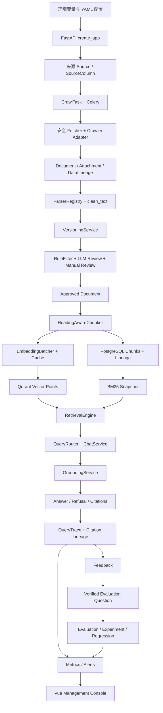

# ODIRAG 系统数据流

本文只描述当前仓库已经实现的数据流。PostgreSQL 是业务事实来源；Qdrant、BM25 和缓存均为可重建派生状态；外部 Provider 不可用时系统报告失败或降级，不生成虚假成功数据。

## 1. 全链路总览



## 2. 应用启动与依赖装配

1. `backend/app/config.py:Settings` 从 `ODIRAG_` 环境变量和 `.env` 读取配置。
2. staging/production 会拒绝默认 JWT、明文管理员密码、debug、关闭限流和非 HTTPS CORS。
3. `backend/app/main.py:create_app()` 创建 `DatabaseManager`、`MetricsRegistry`、进程内限流器和 `ApplicationRuntime`。
4. `backend/app/runtime.py` 按配置选择 deterministic/remote embedding、memory/Redis cache、memory/Qdrant vector store、disabled/deterministic/remote rerank、Direct/Coze LLM。
5. lifespan 可在显式 `auto_create_schema` 下建表，并通过 `AuthService.bootstrap_admin()` 引导管理员。
6. CORS、限流、请求 ID/日志和指标中间件包围所有 API 路由。

## 3. 认证数据流

```text
POST /api/auth/login
  -> UserRepository.get_by_username
  -> Passlib verify
  -> access + refresh JWT（包含 user id、type、jti、ver）

POST /api/auth/refresh
  -> 校验 refresh token
  -> 比较 users.token_version
  -> bump token_version
  -> 签发新 token pair

POST /api/auth/logout
  -> bump token_version
  -> 旧 access/refresh 全部失效
```

前端 `frontend/src/api/client.ts` 遇到 401 时只执行一个共享 refresh Promise；刷新成功后原请求最多重试一次。token 存于 `sessionStorage`，不是 HttpOnly cookie，因此仍依赖 CSP 和 XSS 防护。

## 4. 来源与抓取数据流

1. `/api/sources` 把 `SourceCreate` 写入 `sources` 和 `source_columns`。
2. `/api/sources/{id}/test` 使用与抓取相同的 `HttpFetcher` 安全策略测试连通性。
3. `/api/crawl-tasks` 创建 pending `CrawlTask`，然后向 Celery 发送 `odirag.crawl.execute`。
4. worker 调用 `CrawlRepository.claim_task()`，只有 `status=pending` 的一行能原子变为 running。
5. `CrawlerAdapterRegistry` 根据 `parser_type` 选择 `GenericCrawler` 或 `GovCnLatestJsonAdapter`。
6. `HttpFetcher` 对初始 URL 和每个重定向目标做 DNS/公网地址校验；响应以流式累计方式限制字节。
7. 列表页发现详情 URL；详情页提取 title、content、publish date 和允许类型附件。
8. 新文档写入 `Document` 和 source/crawl/document `DataLineage`；相同栏目与 canonical URL 由查询和数据库唯一约束去重。
9. 附件单独写 `Attachment`；下载失败只标附件 failed，不删除主文档。
10. 完成后任务变为 completed；异常时事务回滚并把 running 任务转为 failed。

可靠性补充：Beat 每 60 秒运行 `odirag.crawl.recover`。stale running 任务在恢复次数内回到 pending，否则变为 failed；所有 pending task 再次入队。

## 5. 解析、清洗和版本数据流

```text
Attachment.local_path / Document.raw_content
  -> ParserRegistry
  -> HTML/PDF/DOCX/XLSX/TXT/ZIP parser
  -> ParsedArtifact
  -> clean_text
  -> content_hash
  -> VersioningService
```

- HTML 保留标题、列表、表格和链接 metadata。
- PDF 保留 pages，削减重复页眉页脚，文本过少只标 `requires_ocr`。
- DOCX 保留 Heading、表格和 hyperlink。
- XLSX 以 read-only 方式输出 sheet 表格与行字典。
- ZIP 只输出目录 metadata 和 unsafe path 标记，不解压。
- 内容哈希未变时不创建版本。
- 内容变化时保存快照、`version + 1`、更新 SimHash 和 changed fields，并把 `index_status` 设为 stale。

## 6. 审查与知识抽取数据流

1. `RuleFilter` 根据内容长度、拒绝正则、关键词和官方来源计算分数与 reason codes。
2. hard reject 直接保存 rule review 并把文档置 rejected，不调用 LLM。
3. 其他文档先确保 `PromptVersion` name/version/content 不可变。
4. `DirectLLMAdapter` 或 `CozeAdapter` 返回严格 `ReviewResult`。
5. `ReviewService` 只接受字段白名单；每个 `evidence_quote` 必须是正文子串。
6. 规则和 LLM 分别写 `DocumentReview`；字段写入 `StructuredKnowledge`。
7. 自动结果可以是 approved、rejected 或 pending_manual_review。
8. 人工操作新增 manual review，并更新最终状态。

Provider 不可用时文档变为 `pending_llm`，接口返回结构化 503；系统不会默认批准。

## 7. 分块与索引数据流

1. `/api/documents/{id}/reindex` 只接受 approved 文档。
2. `HeadingAwareChunker` 按标题和段落分块，超长文本按分隔符和字符上限回退。
3. 已解析附件按 `\f` 页切开，chunk 保存 attachment_id 与 page_number。
4. `EmbeddingBatcher` 先查版本化缓存，再分批调用 Provider，失败最多重试三次。
5. `IndexingService` 验证向量维度并确保 Qdrant collection/payload index。
6. chunk ID 是包含文档版本、附件、页码、模型、embedding 版本和内容哈希的 UUID5。
7. 向量 upsert 成功后，PostgreSQL 替换 chunk 并写完整 lineage。
8. 数据库切换后删除 stale vector points，最后把 chunk/document 设为 indexed。
9. 若中途失败，文档标 failed；数据库切换前的新向量会尝试补偿删除。
10. `BM25RebuildService` 从 PostgreSQL indexed chunks 重建进程内索引或 JSON 快照。

## 8. 检索与路由数据流

`RetrievalQueryAnalyzer` 规范化 query，提取 terms，并推断 region 和 date filters。显式 filters 覆盖推断值，未知字段返回 422。

四种检索模式：

```text
bm25            -> BM25 only
vector          -> query embedding + VectorStore
hybrid          -> BM25 + vector + RRF
hybrid_rerank   -> BM25 + vector + RRF + RerankProvider
```

RRF 对每个排名累加 `1/(rrf_k+rank)`，不直接相加不可比较的原始分数。Remote rerank 返回的 index、重复和 score 范围会被严格验证。

`QueryRouter` 根据 aggregate/semantic 关键词分类：

- SQL：只执行 SQLAlchemy 白名单 count 模板；
- RAG：执行混合检索；
- SQL+RAG：用同一 filters 统计完整集合，再检索证据总结。

当前没有执行 LLM 生成 SQL 的路径。

## 9. 回答、拒答和引用数据流

`GroundingService` 依次检查：

1. eligible hit 数量和分数；
2. 是否有官方来源；
3. query 是否被正文词项/中文双字片段覆盖；
4. 同一政策是否有状态冲突；
5. 是否存在更新政策。

不充分时生成 refusal 和稳定 reason codes。充分时：

- extractive 模式直接使用真实 quote；
- LLM 模式只接收 eligible context，并必须返回合法 cited chunk IDs；
- 回答中的 URL 必须来自最终 Citation 集合。

每个 Citation 均包含真实 document ID、chunk ID、title、source、publish date、URL、page 和 quote。

## 10. Trace 与血缘数据流

每次 Chat 将以下内容写入 `QueryTrace`：

- query type 与 filters；
- BM25/vector/fusion/rerank/final context；
- prompt version 和完整 snapshot；
- model、answer、citations、refusal；
- latency、token usage 和 cost。

`LineageService.answer_lineage()` 以 citation.chunk_id 查询：

```text
QueryTrace
  -> Citation
  -> Chunk
  -> Document
  -> DocumentVersion
  -> CrawlTask
  -> Source
```

缺少环节时返回 `complete=false` 和 `missing_steps`，不会伪造完整链。

## 11. 反馈、评估与实验数据流

Feedback 支持 helpful、not_helpful、incorrect_citation、missing_document、incomplete_answer、should_refuse、should_not_refuse。除 helpful 外，可转换类型生成稳定 `feedback-{id}` 的 verified question。

`EvaluationRunner` 对每题执行真实 retrieval/chat callback，计算逐题和聚合指标，写 JSON、CSV、Markdown、chart data。异常按 retrieval/chat stage 记录，默认不终止其他题。

实验框架为 baseline 和 candidate 构建各自 chunk/embedding/retrieval/rerank/prompt 配置，分别运行评估，再比较 metric delta、候选失败和新回归。实验用内存派生索引隔离 variant，不覆盖生产 runtime 索引。

## 12. 监控与告警数据流

`MetricsRegistry` 记录有限长度的路由和数据库延迟样本，输出 average/P50/P95/P99。`MonitoringService` 聚合：

- crawler 任务与条目失败率；
- knowledge 文档、审批、索引、stale 和 chunk；
- RAG query/refusal/latency/token/cost/trace completeness；
- evaluation regression count；
- database、Redis、Qdrant health。

阈值超过时写持久化 `Alert`。相同 alert_key 更新 occurrence 和 last_seen；恢复后自动 resolved；管理员可 acknowledge/resolve。

## 13. 前端数据流

Vue 页面只调用 `frontend/src/api/resources.ts`。`api/client.ts` 统一 Bearer token、refresh rotation、错误解析和一次重试。`AsyncState` 表示 loading/error/empty，`MarkdownContent` 使用 DOMPurify。

页面覆盖：Dashboard、Sources、Crawl Tasks、Documents、Document Detail、Reviews、Chat、Evaluations、Experiments、Monitoring、Activity。AppShell 每 60 秒轮询公共 health，并在移动/桌面布局间响应。

## 14. 容器运行数据流

Compose 包含 backend、frontend、postgres、redis、qdrant、worker、scheduler、nginx。backend entrypoint 创建 `/app/data` 并运行 Alembic；worker/scheduler 等待 backend healthy 且不重复迁移。一键脚本启用 `ui` 与 `async` profiles，等待 backend healthy 后 seed 并通过真实 API reindex demo 文档。

## 15. 数据所有权表

| 数据 | 真源 | 派生/缓存 | 重建方式 |
| --- | --- | --- | --- |
| 来源、任务、文档、版本、审查、知识 | PostgreSQL | 无 | Alembic + 业务输入 |
| Chunk 与血缘 | PostgreSQL | Qdrant payload | 重新 index approved documents |
| 向量 | Qdrant | Embedding cache | 重新 Embedding/upsert |
| BM25 | PostgreSQL indexed chunks | JSON snapshot/内存 | `scripts/rebuild_bm25.py` |
| Embedding cache | Redis DB 0 | 无 | 可清空后按需重算 |
| Celery 消息/结果 | Redis DB 1/2 | PostgreSQL task status | pending/stale recovery |
| Query trace、feedback、evaluation、alerts | PostgreSQL | 报告文件 | 以数据库与固定数据集重新运行 |
| 前端会话 | 浏览器 sessionStorage + 后端 token_version | 无 | 重新登录 |

## 16. 关键状态迁移

```text
CrawlTask: pending -> running -> completed/failed/cancelled
                         -> stale recovery -> pending/failed

Document final_status: pending -> rejected/pending_llm/pending_manual_review/approved

Document index_status: pending/stale/failed -> indexing -> indexed/failed

Alert: open -> acknowledged -> resolved
       resolved -> open（条件再次出现）
```

## 17. 诚实限制

- 本机 Docker 未运行，因此完整八服务启动仍需有 Docker 的环境或 CI 验证。
- 进程指标和固定窗口限流是单进程状态，多副本需共享实现。
- DNS 校验与 socket 连接之间仍有 rebinding 时间窗，生产需网络出口策略。
- PDF 只检测 OCR 需求，没有内置 OCR Provider。
- SimHash 与权威来源选择已实现，但未完整贯通自动近重复归并主链。
- 前端使用 fetch/reactive module，而不是目标栈中的 Axios/Pinia/UI 框架/ECharts。
- 当前自动化前端测试有限，缺少 Playwright 全流程 E2E。
- deterministic Provider 和本地负载结果只能证明工程链路，不代表外部模型或生产容量。
